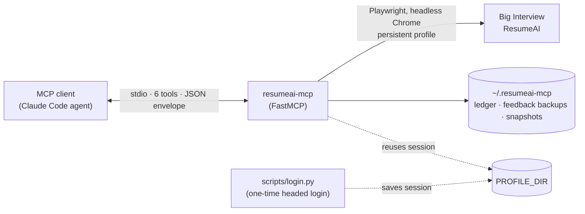
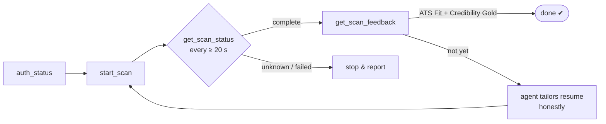

<div align="center">



<p>
  <a href="https://www.python.org/"></a>
  <a href="https://modelcontextprotocol.io"></a>
  <a href="https://gofastmcp.com"></a>
  <a href="https://playwright.dev/python/"></a>
  <a href="https://docs.astral.sh/uv/"></a>
  
  <a href="LICENSE"></a>
</p>

**Scan your resume against a job description on Big Interview ResumeAI, read the structured feedback,
and let your AI agent tailor → rescan until ATS Fit and Credibility both hit Gold. Honestly.**

[Quick start](#-quick-start) · [Install](#-installation) · [Tools](#-tools) · [How it works](#-how-it-works) ·
[Troubleshooting](#-troubleshooting) · [Spec](PLAN.md) · [Agent runbook](RUNBOOK.md)

</div>

---

<div align="center">

</div>

## ✨ Why

Big Interview ResumeAI has **no public API**. `resumeai-mcp` is a local [MCP](https://modelcontextprotocol.io)
server (stdio) that drives the website for you with Playwright in a real Chrome profile, so an agent such as
Claude Code can:

- 📤 **Scan** a PDF/DOCX resume against a job description (idempotent: identical inputs reuse the old scan, no allowance spent)
- ⏱️ **Poll** scan status without hammering the site
- 🏅 **Read feedback as strict JSON**: overall medal, 4 category badges, every criterion, action items, matched/unmatched ATS keywords
- 🔁 **Loop**: tailor → rescan until ATS Fit + Credibility are Gold, with stopping rules ([RUNBOOK.md](RUNBOOK.md))
- 🗂️ **Keep history locally**: a ledger and feedback backups, so tidying up My Scans never loses data

🔒 **No password is ever stored.** You log in once by hand (SSO + MFA); the server reuses that browser session.
🐢 **Account-safe by design:** 2–5 s human-like pauses, one scan in flight, ≤ 12 scan operations per day.

> [!NOTE]
> Unofficial, personal-use tool, not affiliated with Big Interview. Built and verified against the Northeastern
> portal (`neu.biginterview.com`). Other schools' portals can be set with `BASE_URL`, but are untested.

## 🚀 Quick start

Already have `uv`, Google Chrome and Claude Code? Four commands:

```bash
git clone https://github.com/devpatel25/Biginterview-MCP.git && cd Biginterview-MCP
uv sync --frozen && cp .env.example .env
uv run python scripts/login.py        # log in with SSO + MFA in the Chrome window, then press ENTER
claude mcp add --scope user resumeai -- uv --directory "$PWD" run resumeai-mcp
```

Open a new Claude Code session and ask: *"Check my Big Interview status."* Details for each step are below.

## 📦 Installation

### 1. Requirements

| need | why | get it |
|---|---|---|
| macOS or Linux | tested on macOS | — |
| Python **3.11+** | runtime | `uv` can install it for you: `uv python install 3.12` |
| [`uv`](https://docs.astral.sh/uv/) | installs the exact locked dependencies | `curl -LsSf https://astral.sh/uv/install.sh \| sh` (or `brew install uv`) |
| Google Chrome | the browser the server drives | [google.com/chrome](https://www.google.com/chrome/), or bundled Chromium (see below) |
| An MCP client | calls the tools | [Claude Code](https://docs.claude.com/en/docs/claude-code) (`npm install -g @anthropic-ai/claude-code`), or any stdio MCP client |
| A Big Interview account | the scans are yours | NEU: `https://neu.biginterview.com` |

### 2. Install the server

```bash
git clone https://github.com/devpatel25/Biginterview-MCP.git
cd Biginterview-MCP
uv sync --frozen          # exact locked versions (fastmcp 2.14.7 + mcp 1.30.0); don't pip-install instead
cp .env.example .env      # defaults work for NEU; edit only if you need to
uv run pytest -q          # optional: offline self-check, no browser, no scans
```

The default `BROWSER_CHANNEL=chrome` uses your installed Google Chrome. If Chrome is missing, run
`uv run playwright install chrome`, or use bundled Chromium: `uv run playwright install chromium` and set
`BROWSER_CHANNEL=` (empty) in `.env`.

<details>
<summary><b>⚙️ <code>.env</code> settings</b></summary>

| `.env` key | default | meaning |
|---|---|---|
| `BASE_URL` | `https://neu.biginterview.com` | your school's Big Interview portal |
| `DATA_DIR` | `~/.resumeai-mcp` | ledger, feedback backups, snapshots (created `0700`) |
| `PROFILE_DIR` | `~/.resumeai-mcp/resumeai-profile` | the browser profile = your login session (`0700`) |
| `HEADLESS` | `true` | run the browser invisibly |
| `BROWSER_CHANNEL` | `chrome` | `chrome`, or empty for bundled Chromium |
| `NAV_TIMEOUT_MS` | `30000` | page-load timeout |
| `HUMAN_DELAY_MIN_S` / `_MAX_S` | `2` / `5` | random pause between UI actions |

</details>

### 3. Log in (once, and whenever the session expires)

```bash
uv run python scripts/login.py          # opens Chrome: log in with SSO + MFA, then press ENTER in the terminal
uv run python scripts/login.py --check  # headless check → prints logged_in=true
```

The session lives in `PROFILE_DIR`. Your school's SSO usually re-authenticates silently, so you rarely need to
repeat this.

> [!WARNING]
> **Never run `login.py` while your MCP client is using the server**: the two can't share the profile
> (you'll get `profile_in_use`).

### 4. Connect your MCP client

**Claude Code** (run from the repo folder, or replace `"$PWD"` with the absolute repo path):

```bash
claude mcp add --scope user resumeai -- uv --directory "$PWD" run resumeai-mcp
claude mcp get resumeai   # Status: ✔ Connected
```

Start a new Claude Code session so it picks up the tools.

<details>
<summary><b>Other stdio MCP clients (JSON config)</b></summary>

Most clients accept an `mcpServers` entry like this. Use absolute paths; if the client can't find `uv`,
use its full path (`which uv`).

```json
{
  "mcpServers": {
    "resumeai": {
      "command": "uv",
      "args": ["--directory", "/absolute/path/to/Biginterview-MCP", "run", "resumeai-mcp"]
    }
  }
}
```

</details>

### 5. First scan

In Claude Code, ask for example:

> Check my Big Interview status, then scan `/Users/me/resumes/Resume.pdf` for "Data Science Co-op" at
> "Acme" with this job description: … Poll until it's done and summarize the feedback.

The agent will call `auth_status` → `start_scan` → `get_scan_status` (every ≥ 20 s) → `get_scan_feedback`.
For the full tailor-and-rescan loop, point the agent at [RUNBOOK.md](RUNBOOK.md).

### Update / uninstall

```bash
git pull && uv sync --frozen                   # update
claude mcp remove resumeai --scope user        # disconnect
rm -rf ~/.resumeai-mcp                         # delete local data AND your saved login session
```

## 🧰 Tools

| tool | what it does |
|---|---|
| `auth_status()` | logged in? scans left today? |
| `list_scans(limit=20, cursor=null)` | past scans, newest first, paged |
| `start_scan(resume_path, job_title, company, job_description, scoring_guide="Graduate - STEM Focus")` | uploads and scans (uses 1 of 5 daily scans); returns the existing scan instead if the exact same inputs were already scanned |
| `get_scan_status(scan_id)` | queued / scanning / complete / failed / unknown |
| `get_scan_feedback(scan_id)` | medal, 4 category badges, every criterion, action items, ATS keywords; saves a local backup |
| `delete_scan(scan_id, confirm=false)` | backs up feedback, then deletes the scan from My Scans |

Every call returns `{"ok": true, "data": …}` or `{"ok": false, "error": {"code", "message", "hint"}}`.

**Limits built in:** 5 scans/day (the site's), at most 12 scan operations (starts + deletes) per day, one scan
in flight, 2–5 s pauses between clicks, one tool at a time. `resume_path` must be an absolute path to a
text-based PDF/DOCX (not a scanned image), 5 MB max. The default scoring guide is NEU's; pass
`scoring_guide` with the exact name your portal shows if it differs.

<details>
<summary><b>Example <code>get_scan_feedback</code> result (illustrative)</b></summary>

```jsonc
{ "ok": true, "data": {
  "scan_id": "123456", "role_title": "Data Science Co-op", "company": "Acme",
  "scoring_guide": "Graduate - STEM Focus", "medal": "gold", "partial": false,
  "categories": {
    "readability": { "badge": "gold",   "criteria": [ … ] },
    "credibility": { "badge": "silver", "criteria": [ … ] },
    "ats_fit":     { "badge": "gold",   "criteria": [ … ],
                     "keywords_matched": ["Python", "SQL"], "keywords_unmatched": ["Airflow"] },
    "format":      { "badge": "gold",   "criteria": [ … ] }
  },
  "action_items": [ { "category": "credibility", "item": "…", "priority": "high" } ]
} }
```

Full schemas: [PLAN.md §7–§8](PLAN.md#7-mcp-tool-specifications).

</details>

> [!IMPORTANT]
> **Honesty rule.** Unmatched keywords are *verification candidates*, not a shopping list. The agent may add a
> keyword only when your real experience, projects or coursework back it. A truthful Silver beats a fabricated Gold.

## 🧭 How it works





The server never clicks blindly: every step checks for a known landmark first and stops with `site_changed`
if the page looks different. Full design: [PLAN.md](PLAN.md).

## 🩺 Troubleshooting

| you see | why | fix |
|---|---|---|
| `auth_expired` | the SSO session ended | `uv run python scripts/login.py`, then retry |
| `profile_in_use` | `login.py` (or another Chrome) holds the profile | close it and retry |
| `internal_error` on every tool | usually Chrome isn't installed / can't launch (details in the server's stderr log) | see [Install](#2-install-the-server) (install Chrome or use Chromium); otherwise report the log |
| `limit_reached` | 0 scans left today, or 12 operations done today | wait until local midnight |
| `invalid_input` "not found" for the scoring guide | guide name doesn't match the site | use the name exactly as shown on the scan page |
| `invalid_input` "no extractable text" | image-only / scanned PDF | export a text-based PDF or DOCX |
| `invalid_input` "still in flight" | a scan is running | poll `get_scan_status` until it completes |
| `unknown_state` | a submission couldn't be confirmed, or a status couldn't be read | **don't rescan**; follow the hint (the next `start_scan` recovers pending submissions) |
| `site_changed` | the website's layout changed | see [When the site changes](#-when-the-site-changes) |
| `network_error` | portal unreachable | read tools already retried twice: check your connection; after a scan/delete, check My Scans before retrying |
| `storage_error` | `DATA_DIR` not writable / disk full | fix permissions/space; nothing is deleted without a backup |
| `claude mcp get resumeai` not connected | wrong path or venv | re-run `uv sync --frozen` and the `claude mcp add` line with the absolute repo path |

The server logs to stderr (Claude Code shows it in the MCP logs); page contents are never logged.

## 🛠️ When the site changes

Every failed step saves the page to `~/.resumeai-mcp/snapshots/<step>-<time>-<random>.html`. To fix:

1. Open the snapshot named in the error's `hint` and find what moved.
2. Update the locator or parser: scan form → `src/resumeai_mcp/scans.py` (`_submit`); My Scans list →
   `scans.py` (`parse_my_scans`, which reads the `UserResumeAssignmentScansApp` page data); feedback →
   `src/resumeai_mcp/feedback.py` (`ResumeAssignmentReviewSummaryApp` page data); login → `auth.py`.
3. Re-capture a fixture: keep only the parser-relevant element, redact names/emails/filenames/ids, and save
   it as `tests/fixtures/<name>.fixture.html` (the only HTML that may be committed).
4. `uv run pytest -q`, then record the change as a dated amendment in PLAN.md.

## 🔐 Your data

Everything stays on your machine under `DATA_DIR` (`0700`): `ledger.jsonl` (the scans this server created, with
file hashes, never resume text), `feedback/<scan_id>.json` backups (kept), and `snapshots/` (full page HTML,
which is personal data: deleted automatically after 30 days, checked at every server start and every new
snapshot). `PROFILE_DIR` holds your session cookies: treat it like a password; never copy, share or commit it.

## 🧪 Development

```text
src/resumeai_mcp/
├── server.py     FastMCP app, 6 tools, JSON envelope, retries
├── browser.py    Playwright persistent context, human-like delays, snapshots
├── auth.py       login detection, auth_status
├── scans.py      list / start / status / delete, reuse key, daily budget
├── feedback.py   feedback-page parser → ScanFeedback
├── storage.py    ledger, feedback backups, snapshot retention
├── schemas.py    pydantic models
└── config.py     settings from .env
scripts/login.py  one-time headed login
tests/            offline tests + redacted HTML fixtures
```

```bash
uv run pytest -q          # offline: no browser, no site, no scans
```

Live changes are checked by hand (they use real scans): `login.py --check` → `auth_status` → `list_scans` →
`start_scan` → poll → `get_scan_feedback` → the same `start_scan` again returns `reused=true` →
`delete_scan` backs up first and reports `allowance_restored` truthfully.

Contributions welcome: open an issue or PR. Keep changes within [PLAN.md](PLAN.md), and record site-driven
changes as dated amendments there.

## 📄 License

[MIT](LICENSE) © 2026 Dev Patel
